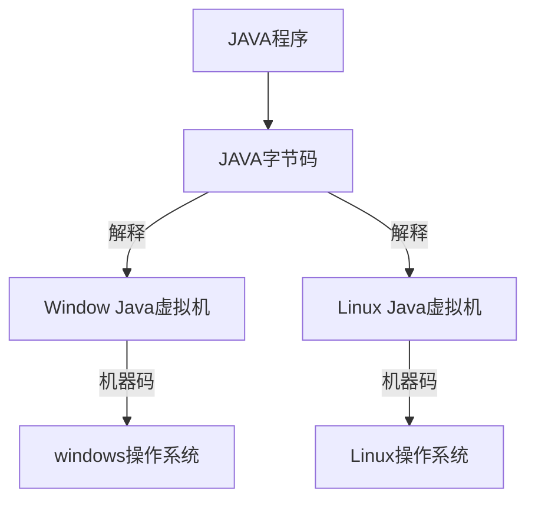
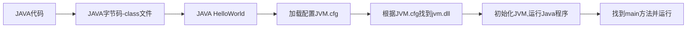
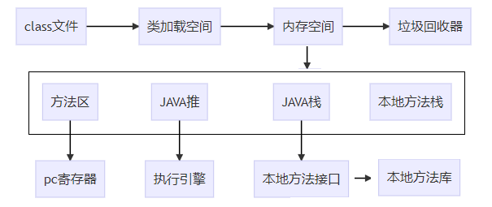

## JVM模型: 一次编译，到处运行



java程序经过一次编译之后，将java代码编译为字节码也就是class文件，然后在不同的操作系统上依靠不同的java虚拟机进行解释，最后再转换为不同平台的机器码，最终得到执行。


## java程序执行流程




### 编译Java代码

java代码通过编译之后生成字节码文件（class文件）。这个过程由JAVA编译器完成。


### 运行 `java HelloWorld` 指令

运行`java HelloWorld`执行java程序，java会根据系统版本找到jvm.cfg，由该文件找到对应的JVM编译命令，对java程序进行编译。其中`$\JAVA_HOME\jre\lib${amd64}\jvm.cfg` 大致内容长这样：

```shell
# Copyright (c) 2003, 2013, Oracle and/or its affiliates. All rights reserved. 
# You may also select a JVM in an arbitrary location with the 
# "-XXaltjvm=<jvm_dir>" option, but that too is unsupported 
# and may not be available in a future release. 

-Xms 1024
-server KNOWN
-client IGNORE
```

> server KNOWN 和 client IGNORE：分别说明当前JVM运行于服务端模型，而不是客户端模型 即 server KNOWN 就表示名称为server的jvm可用, 且如笔者主机下的地方找到对应的jvm.dll
>  ..\JetBrains\IntelliJ IDEA...\jbr\bin\server\jvm.dll
>  ..\Java\jre\bin\server\jvm.dll ...


### JVM.cfg

  jvm.dll则是java虚拟机的主要实现。


### 运行程序

通过JNI接口（它还常用于java与操作系统、硬件交互），找到class文件后并装载进JVM，然后找到main方法，最后执行。


## JVM基本结构

JVM是可运行Java代码的假想计算机 ，包括一套字节码指令集、一组寄存器、一个栈、一个垃圾回收，堆 和 一个存储方法域。JVM是运行在操作系统之上的，它与硬件没有直接的交互。下图是JVM的基本结构：




class文件被jvm装载以后，经过jvm的内存空间调配，最终是由执行引擎完成class文件的执行。当然这个过程还有其他角色模块的协助，这些模块协同配合才能让一个java程序成功的运行，下面就详细介绍这些模板，它们也是后面**学习jvm最重要的部分**。


### 内存空间

JVM内存空间包含：方法区、java堆、java栈、本地方法栈。


### 方法区

方法区是各个线程共享的区域，存放类信息、常量、静态变量。


### java堆

java堆也是线程共享的区域，我们的类的实例就放在这个区域。

可以想象你的一个系统会产生很多实例，因此java堆的空间也是最大的。如果java堆空间不足了，程序会抛出OutOfMemoryError异常。

**堆内存划分**：

- JDK 1.8和以前
   在JDK7以及其前期的JDK版本号中。堆内存通常被分为三块区域Nursery内存(young generation)、长时内存(old generation)、永久内存(Permanent Generation for VM Matedata)。

- JDK 1.8以后
   JDK 1.8以后Java 堆主要分为2个区域-年轻代与老年代，年轻代包括Eden 区和 Survivor 区，Survivor 区又分From区和 To区。

>  JDK 1.8以后不再用永久带，永久代已经不存在，存储的类信息、编译后的代码数据等已经移动到了元空间（MetaSpace）中，元空间并没有处于堆内存上，而是直接占用的本地内存（NativeMemory）。


### java栈

栈也叫栈内存，主管Java程序的运行，是在线程创建时创建，一个线程对应一个java栈，每执行一个方法就会往栈中压入一个元素。它的生命期是跟随线程的生命期，线程结束栈内存也就释放，对于栈来说不存在垃圾回收问题，只要线程一结束该栈就Over，生命周期和线程一致，是线程私有的。

往栈中压入一个元素叫“栈帧”，而栈帧中包括了方法中的局部变量、用于存放中间状态值的操作栈。

> 如果java栈空间不足了，程序会抛出StackOverflowError异常
> 想一想什么情况下会容易产生这个错误：**递归**，递归如果深度很深，就会执行大量的方法，方法越多java栈的占用空间越大。


#### 栈运行原理

栈中的数据都是以栈帧（Stack Frame）的格式存在，栈帧是一个内存区块，是一个数据集，是一个有关方法和运行期数据的数据集。当一个方法A被调用时就产生了一个栈帧F1，并被压入到栈中，A方法又调用了B方法，于是产生栈帧F2也被压入栈，B方法又调用了C方法，于是产生栈帧F3也被压入栈…… 依次执行完毕后，先弹出后进......F3栈帧，再弹出F2栈帧，再弹出F1栈帧。其顺序遵循**先进后出**、**后进先出**原则。


#### 帧的组成

1. 局部变量表(Local Stack Frame)：是一组变量值的存储空间，包括方法参数和局部变量，其中方法参数按照声明顺序严格放置，局部变量可任意放置。

2. 操作数栈(Operand Stack):  也称为操作栈，是一个后入先出栈。在Class 文件的Code 属性的 max_stacks 指定了执行过程中最大的栈深度。
3. 动态链接(Dynamic Linking):  每个栈帧都包含一个执行运行时常量池中该栈帧所属方法的引用，该引用可支持方法调用过程中的动态连接(Dynamic Linking)。
4. 返回地址(Return Address)： 当一个方法被执行后，有两种方式退出该方法：执行引擎遇到了任意一个方法返回的字节码指令或遇到了异常，并且该异常没有在方法体内得到处理。方法退出的过程实际上等同于把当前栈帧出栈。


### 本地方法栈

本地方法栈角色和java栈类似，只不过它是用来表示执行本地方法的，本地方法栈存放的方法调用本地方法接口，最终调用本地方法库，实现与操作系统、硬件交互的目的。


### PC寄存器

PC寄存器的作用就是控制程序指令的执行顺序。执行引擎就是根据PC寄存器调配的指令顺序，依次执行程序指令。

> “类已经加载了，实例对象、方法、静态变量都去了自己该去的地方"，那么程序该怎么执行，哪个方法先执行，哪个方法后执行，这些指令执行的顺序就是PC寄存器在管。


