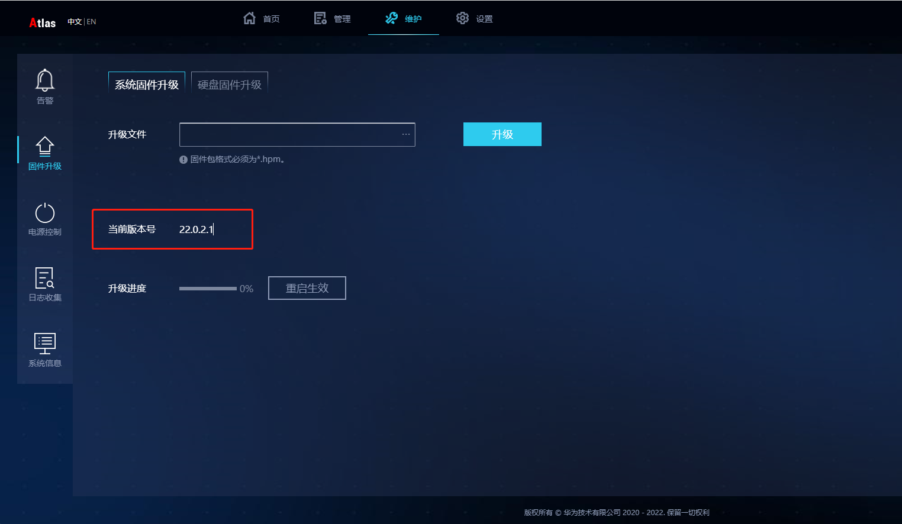
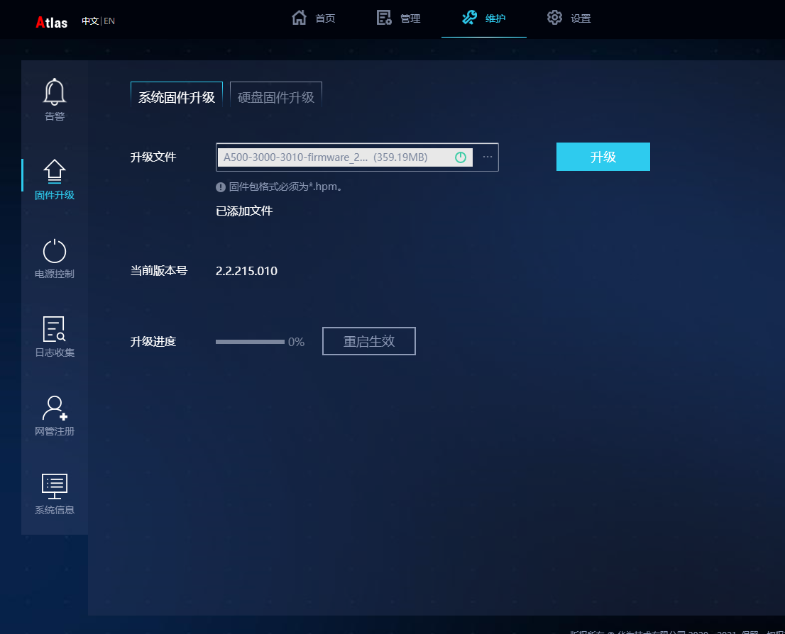
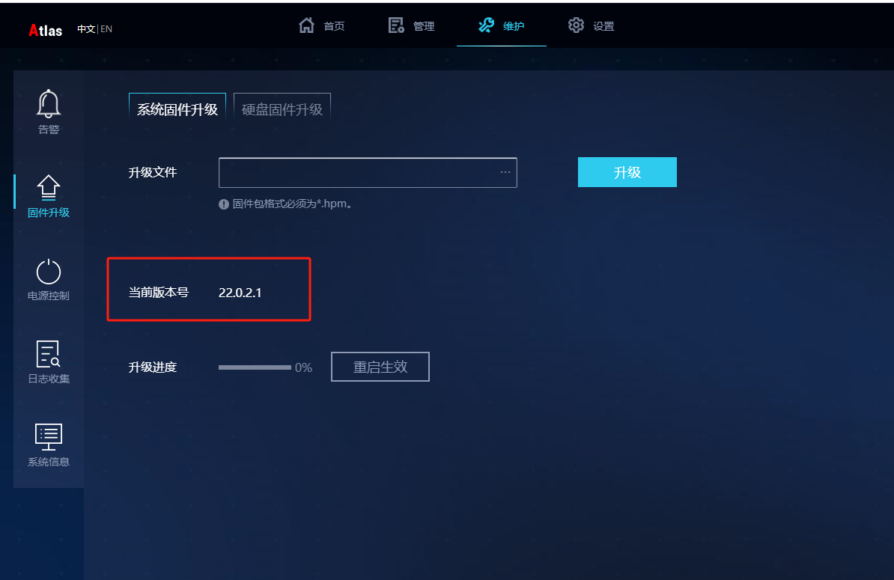
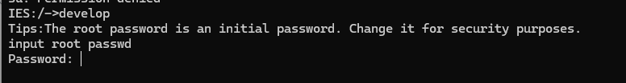
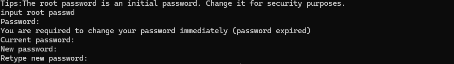
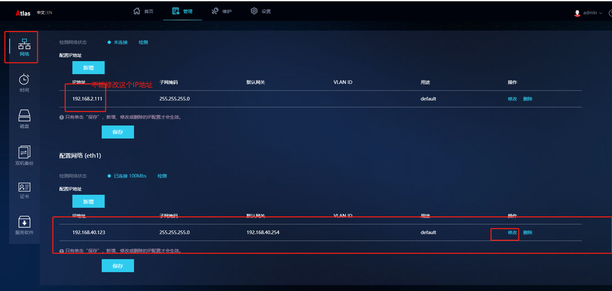
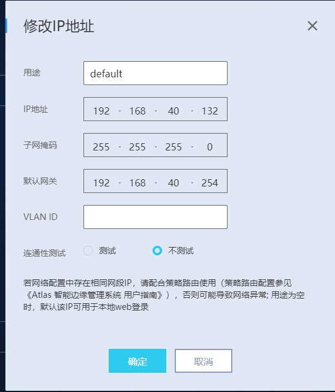
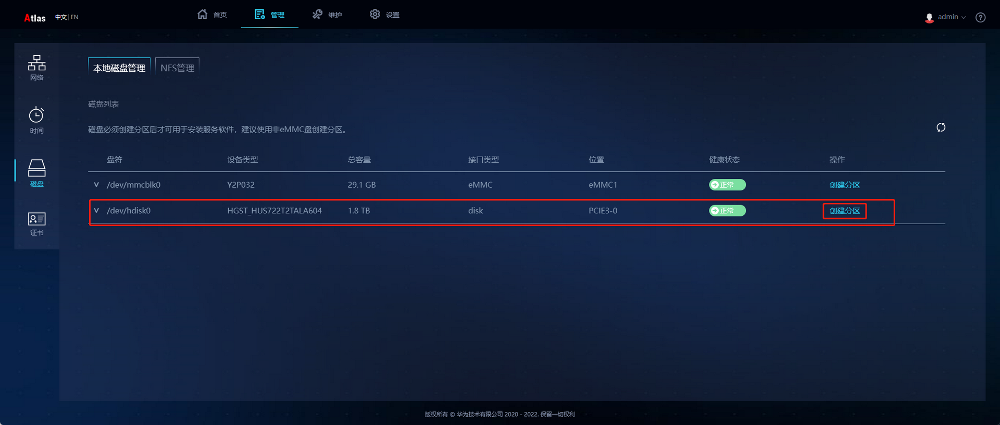
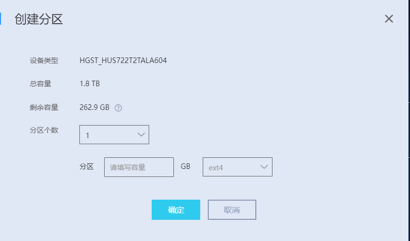
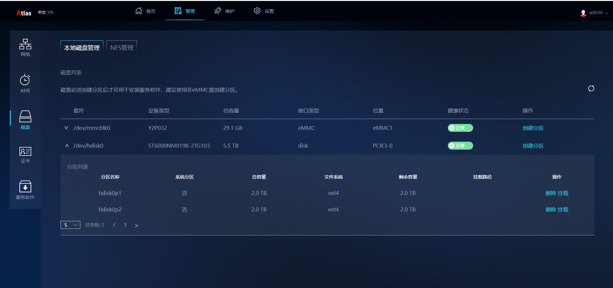

华为小站配置
# 配置华为小站

## 1\. 登录管理系统

默认地址为: https://192.168.2.111/ (注意需要https)

> 第一次登录需要,初始账号:admin,初始密码:Huawei12#$  
> 提示修改密码,修改成:用户名:admin,密码:Samples@012
> 最后还会提示修改密码,最终密码为:Huawei@SYS3

- lan1对应的是192.168.2.111, lan2对应的是192.168.3.111

## 2\. 检查版本号



> 要求的版本号为:22.0.2.1,如果不是需要升级

- 20.2.xx及以下版本需要先升级到20.3.0版本；再由20.3.0版本升级到21.0.4.9版本；21.0.4.9版本可直接升级到21.0.4.9之后的任意版本。具体的版本升级和回退约束请参考各个版本的升级指导书。

### 2.1 升级到过度版本 20.3.0

  
下载地址  
[A500-3000-3010-firmware\_20.3.0.zip](https://gh-proxy.com/https://github.com/jadehh/samples/releases/download/v1.0.7/A500-3000-3010-firmware_20.3.0.zip)

### 2.2 升级到过度版本 21.0.4.9

下载地址  
[A500-3000-3010-firmware\_21.0.4.9](https://gh-proxy.com/https://github.com/jadehh/samples/releases/download/v1.0.7/A500-3000-3010-firmware_21.0.4.9)

> 升级过程如遇到无法打开网页的问题，尝试重置  
> [重置链接](https://support.huawei.com/enterprise/zh/doc/EDOC1100133176?section=j020)

### 2.3 升级到22.0.2.1



## 3\. SSH测试

```
sshpass -p "Huawei12#$" ssh admin@192.168.2.111
IES:/->develop
```

> SSH连接,第一次需要先修改SSH密码,ssh初始密码为:Huawei12#$,修改成Samples@012

### 3.1 修改develop密码·



> 默认密码为:Huawei@SYS3,修改成:Samples@012



> 需要输入两遍初始密码,和修改后的密码

### 3.2 修改DNS

```bash
rm -r /etc/resolv.conf  && echo "nameserver 218.2.135.1" > /etc/resolv.conf

```

### 3.3 启动能力项

```bash
cd /opt/middleware/MindXOM/bin
./om_ability_policy.sh allow --net_config --disk_ops --profile_ops --account_modify
systemctl restart ibma-edge-start.service
```

## 4. 修改IP地址

### 4.1 网页修改ip地址

  
点击保存

- 一定要注意修改lan2 192.168.3.111的ip地址，不要修改192.168.2.111  
    

### 4.2 强制修改ip地址

~~或者强制修改ip地址~~

```bash
vi /etc/sysconfig/network-scripts/ifcfg-eth0
```

```text
BOOTPROTO=""
DEVICE="eth0"
IPADDR="192.168.29.194"
NETMASK="255.255.255.0"
GATEWAY="192.168.29.254"
STARTMODE="auto"
ARPCHECK="no
```

重启网络

```bash
/etc/init.d/network restart
```

> 此方法慎用,IP地址改了后通过新的ip地址去连接SSH

## 5. 分配磁盘

  
填写磁盘大小  


> 进入develop模式挂载磁盘

### 5.1 磁盘挂载



```bash
mkdir /home/samples && mkdir /root/Docker && mkdir /home/samples/sda2
echo "/dev/hdisk0p1      /home/samples/sda2       ext4    defaults    0             0" >> /etc/fstab
echo "/dev/hdisk0p2      /root/Docker       ext4    defaults    0             0" >> /etc/fstab
sudo mount -a 
#赋予权限
chmod 777 /home/samples/sda2

```

> 在将Docker目录重新挂载磁盘

[Docker更改默认保存路径](../PyTorch系列/1.PyTorch零基础入门.md)

## 6\. 安装加密狗驱动

通过SSH进入develop模式

### 6.1 驱动下载

[下载地址](https://ghproxy.com/https://github.com/jadehh/jadehh_file/releases/download/Container_NpuV1.0.1/Sentinel-LDK.tar.gz)  
命令下载

```bash
wget https://gh.con.sh/https://github.com/jadehh/jadehh_file/releases/download/Container_NpuV1.0.1/aksusbd-8.51-1.aarch64.rpm   --no-check-certificate && rpm -ivh aksusbd-8.51-1.aarch64.rpm && rm aksusbd-8.51-1.aarch64.rpm
```

### 6.2 加密狗配置远程访问

配置文件下载地址  
[下载地址](https://ghproxy.com/https://github.com/jadehh/jadehh_file/releases/download/Container_NpuV1.0.1/hasplm.ini)  
命令下载配置文件

```bash
wget https://gh.con.sh/https://github.com/jadehh/jadehh_file/releases/download/Container_NpuV1.0.1/hasplm.ini
mv hasplm.ini /etc/hasplm/
service hasplmd.service restart

```

> 账号为:admin 密码为:Samples@123


## 8 部署

```bash
docker run   \
  --name ubuntu \
  -itd \
  --network=host \
  --privileged \
  --device=/dev/davinci0 \
  --device=/dev/davinci_manager \
  --device=/dev/hisi_hdc --device=/dev/devmm_svm \
  -v /usr/local/bin/npu-smi:/usr/local/bin/npu-smi \
  -v /var/hasplm:/var/hasplm -v /etc/hasplm:/etc/hasplm \
  -v /home/data/miniD/driver/lib64:/home/data/miniD/driver/lib64 \
  -v /run/board_cfg.ini:/run/board_cfg.ini \
  -v /home/samples/sda2:/home/samples/sda2 \
  --restart=always \
   jadehh/container_ocr:ascend-release-1.0.3 /sbin/init
```

> 注意/home/samples/sda2 是磁盘挂载的目录

- 接下来使用算法配置界面进行部署

## 开启ftp
develop模式下
```bash
sftp enable
```
